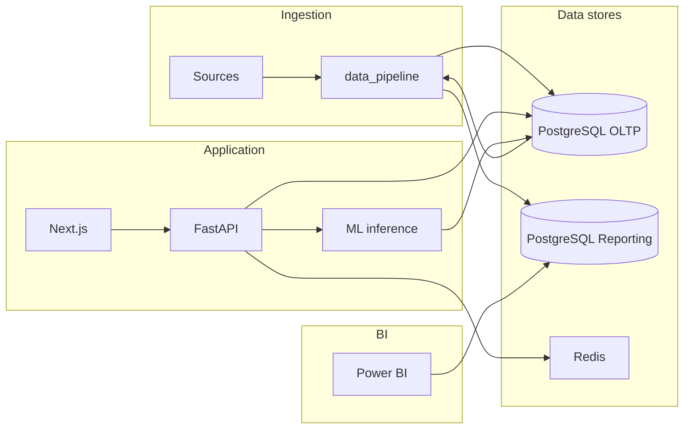

# VulnOps Intelligence Platform — System Architecture (Phase 1)

## 1. Vision

Ingest vulnerability and asset context, persist it in a normalized OLTP store, derive analytics and ML-based prioritization, expose secure APIs, feed a star schema for BI, and present analyst and executive experiences via Next.js and Power BI.

## 2. Logical architecture

| Layer | Responsibility |
|--------|----------------|
| **Client** | Next.js SPA (App Router): auth, dashboards, search, role-aware UI. |
| **API** | FastAPI: REST (versioned `/api/v1`), JWT auth, RBAC, validation, rate limits, audit hooks. |
| **Application services** | Orchestration: vulnerabilities, assets, remediation, analytics aggregation, ML client. |
| **Domain** | Entities and invariants (CVE linkage, asset ownership, SLA rules) — kept framework-agnostic where practical. |
| **Data access** | Repositories + SQLAlchemy/SQLModel; no raw SQL in route handlers. |
| **OLTP (PostgreSQL)** | Transactions: users, roles, org structure, assets, findings, remediation state, audit log. |
| **Reporting (PostgreSQL)** | Star/snowflake: facts (daily snapshot or event grain), dimensions (asset, BU, CVE, time), pre-aggregates for BI. |
| **ETL** | Python batch jobs: extract from OLTP (and optional external feeds), validate, transform, load reporting marts. |
| **ML** | Feature pipeline + trained sklearn model; inference via backend service call or shared package; explainability metadata returned with scores. |
| **Cache / limits** | Redis: session optional, rate limiting, hot dashboard keys. |
| **BI** | Power BI connects to reporting DB (or Azure SQL mirror); embed in app via secure embed / AAD (documented in Phase 6). |
| **Platform** | Docker Compose locally; GitHub Actions CI; secrets via env + secret manager pattern in production. |

## 3. End-to-end data flow

1. **Ingestion:** CSV/API/file drops → `data_pipeline` validates (schemas, referential checks) → loads **OLTP** (findings, assets, CVE metadata, assignments).
2. **Operational use:** Analysts and integrations call **FastAPI** → services enforce RBAC → repositories read/write OLTP → structured logs + audit rows.
3. **Analytics path:** Scheduled ETL reads OLTP (incremental watermark) → builds **fact/dimension** tables → optional materialized views for heavy queries.
4. **ML path:** Training reads OLTP snapshots (Phase 4) → features in `ml/features` → model artifact in `ml/models/artifacts` → inference on API path merges model output with rule-based score.
5. **Frontend:** Next.js obtains JWT → calls API → renders tables/charts; leadership opens Power BI (embedded or linked) fed from reporting schema.

## 4. Major technology choices

| Choice | Why here | Alternatives |
|--------|-----------|--------------|
| **FastAPI + Pydantic** | High-performance async API, automatic OpenAPI, strict validation for security payloads. | Django REST — heavier, slower iteration for API-first design. |
| **PostgreSQL** | Single engine for OLTP and analytical workloads at MVP scale; mature indexing; optional separate DB for reporting on same cluster. | ClickHouse/BigQuery later if volume demands; start simple to show relational modeling skill. |
| **SQLAlchemy 2 + Alembic** | Portable ORM, migration story interviewers expect. | SQLModel reduces boilerplate — acceptable if team prefers; document in ADR. |
| **Redis** | Rate limiting and cache without overloading Postgres. | In-memory only — fails multi-instance deployment. |
| **Next.js + Tailwind** | SSR/SSG for marketing or auth pages, App Router, strong hiring market signal. | Vite SPA — fewer built-in patterns for enterprise SSR/auth. |
| **scikit-learn** | Interpretable models (e.g. gradient boosting / logistic), easy persistence with joblib, good for “explainability” narrative. | XGBoost/LightGBM — can swap for production if latency/size requires; keep sklearn baseline first. |
| **Power BI** | Explicit requirement; natural for executive KPIs and drilldown. | Tableau/Looker — out of scope unless requirements change. |
| **Docker Compose** | Reproducible local stack for recruiters and CI parity. | k8s in `infra/k8s` as later optional path. |

## 5. Core modules (repository mapping)

- `backend/app/api/v1` — Routers only; thin controllers.
- `backend/app/core` — Settings, security (JWT/password hashing), logging config.
- `backend/app/domain` — Pure domain types / rules (optional but recommended for interviews).
- `backend/app/models` — SQLAlchemy tables.
- `backend/app/schemas` — Request/response Pydantic models.
- `backend/app/services` — Business logic and transactions.
- `backend/app/repositories` — DB access per aggregate.
- `backend/app/middleware` — Request ID, CORS, rate limit, optional audit.
- `backend/app/ml` — Thin client loading artifact and calling shared inference code.
- `data_pipeline/*` — Batch ETL entrypoints and validators.
- `ml/*` — Offline training, evaluation, packaged inference.
- `database/*` — DDL reference, seeds, ER exports, mart definitions.
- `frontend/src/*` — UI features aligned with API resources.
- `powerbi/*` — Phase 6 BI specs (connection, model, DAX, dashboards, RLS); see [powerbi/README.md](../../powerbi/README.md).
- `docker/*`, `docker-compose.yml` — Phase 7 API/web/postgres images and local stack; CI in `.github/workflows/ci.yml`.
- `infra/*` — Read-only SQL grants, Kubernetes reference manifests + NetworkPolicies, future IaC.

## 6. Roles (RBAC)

| Role | Capabilities |
|------|----------------|
| **Admin** | User/role management, audit review, system config flags, re-run ETL triggers (protected). |
| **Analyst** | Full read on vulns/assets; update remediation status; export; run searches; view ML explanations. |
| **Manager** | Read aggregated risk by BU/team; SLA views; no sensitive user-admin actions. |
| **Executive (via BI)** | Read-only dashboards; optionally no direct OLTP API access — BI only. |

Implementation: JWT claims include `role` and optional `scopes`; dependency injection in FastAPI enforces route-level policies; Next.js mirrors with route guards.

## 7. Database domains (high level)

**OLTP**

- **Identity:** users, roles, user_roles, sessions/refresh tokens (if stored).
- **Organization:** business_units, teams, locations.
- **Assets:** assets, asset_attributes, ownership links.
- **Vulnerability catalog:** cve_records (or normalized CWE/CVE fields), severity metadata.
- **Findings:** asset_vulnerability instances, status, dates, assignee, evidence refs.
- **Compliance / SLA:** policy thresholds, remediation_deadlines.
- **Audit:** audit_log (who, what, when, before/after JSON).

**Reporting (star-oriented)**

- **Dimensions:** dim_date, dim_asset, dim_business_unit, dim_cve, dim_remediation_owner, dim_severity.
- **Facts:** fact_vulnerability_snapshot (grain: asset×CVE×day or latest snapshot key), fact_remediation_event optional.
- **Aggregates:** precomputed BU risk scores, aging buckets for dashboards.

## 8. API versioning and security baseline

- Prefix `/api/v1`; breaking changes → v2 parallel period.
- Passwords: bcrypt or argon2 via passlib.
- JWT access short-lived; refresh rotated; store refresh hashed if persisted.
- Input: Pydantic + max lengths; output: exclude internal IDs where not needed.
- Structured JSON logging with correlation ID; no secrets in logs.

## 9. Observability (target state)

- Health: `/health`, `/ready` (DB + Redis checks).
- Metrics: Prometheus-compatible counters later or OpenTelemetry traces from FastAPI middleware.
- Audit: append-only audit table for security-relevant mutations.

## 10. Coding standards

- Python 3.12+ in CI; `ruff` + `mypy` on `backend/app` (see Phase 8 workflow); format with `ruff format` if adopted repo-wide.
- Type hints on public functions; `Protocol` for repository interfaces in tests.
- No business logic in FastAPI route bodies beyond orchestration.
- Next.js: TypeScript strict; ESLint + Prettier; feature folders colocate components and hooks.
- Commits: conventional commits optional; ADRs in `docs/adr` for structural changes.

## 11. Testing strategy (summary)

See Phase 1 response checklist in the main delivery; backend pytest with SQLite/Postgres test container; frontend Vitest/RTL; E2E Playwright for auth + critical paths; contract tests for OpenAPI; ETL tests on fixture CSVs; ML tests for feature parity and model smoke inference.
